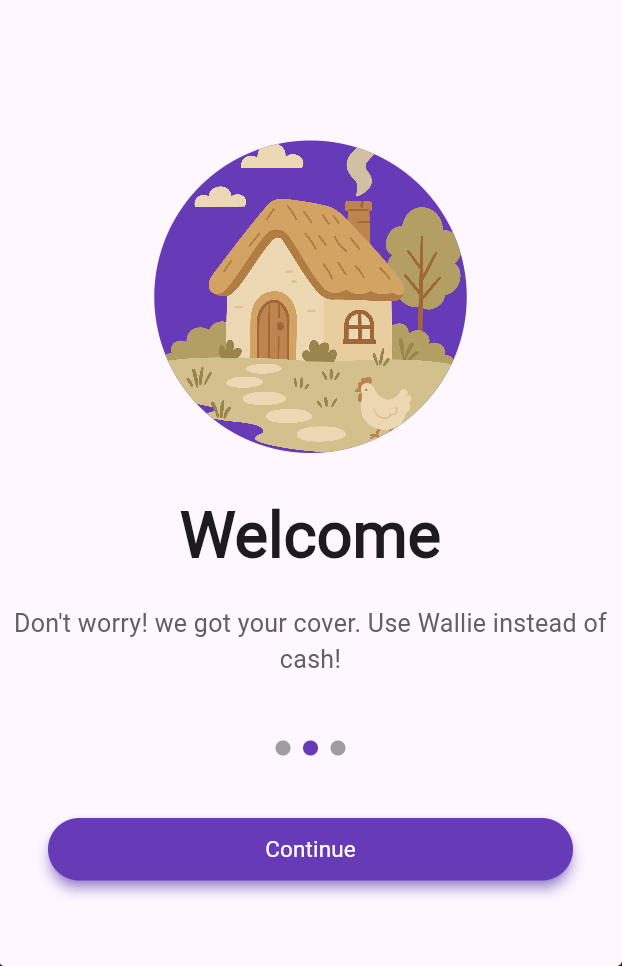
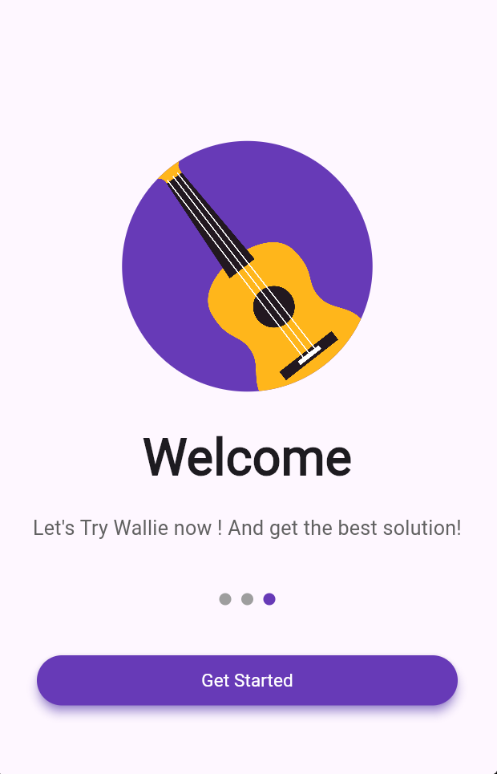
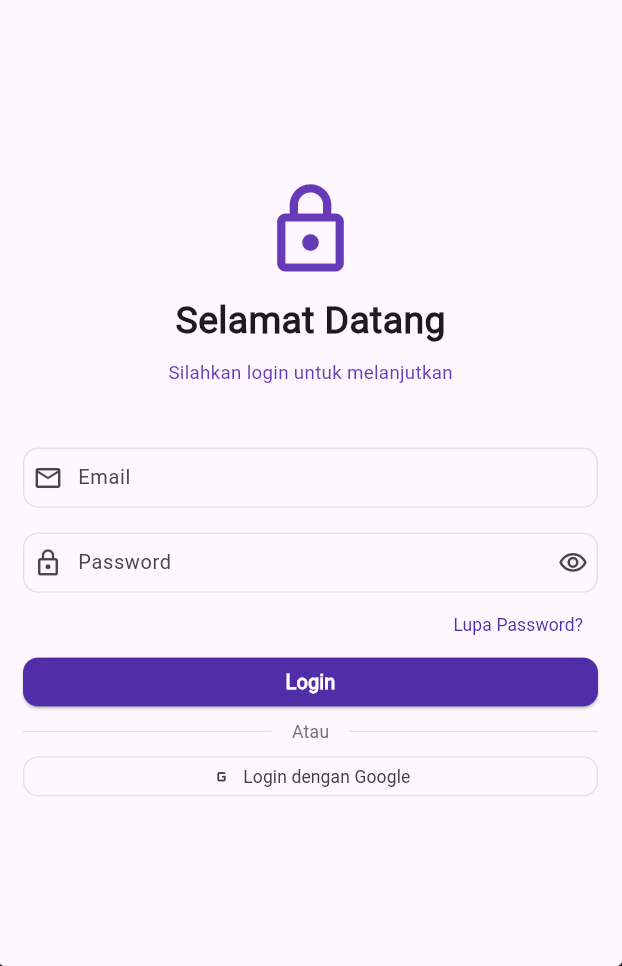

# 📱 UTS Mobile Apps - Aplikasi Flutter 
  
  ### 🎯 **Ujian Tengah Semester - Mobile Apps**
  
  **Dibuat oleh: Farhan Raisprawira Hartama**  
  **NIM: 1123150117**  
  **Kelas: KB1179**  
  **Semester: Ganjil 2025/2026**
  
  [](https://flutter.dev)
  [](https://dart.dev)
  [](https://developer.android.com)
  [](https://developer.apple.com/ios)

</div>

---

## 🌟 **Deskripsi Project**

Aplikasi mobile Flutter yang dikembangkan sebagai bagian dari Ujian Tengah Semester mata kuliah Pemrograman Mobile. Aplikasi ini mendemonstrasikan implementasi berbagai konsep fundamental dalam pengembangan aplikasi mobile menggunakan Flutter framework, termasuk navigasi, state management, UI/UX design, dan integrasi berbagai widget Flutter.

### 🎨 **Tema Aplikasi**
Aplikasi ini menggunakan tema **Material Design 3** dengan skema warna yang konsisten dan user-friendly interface yang memberikan pengalaman pengguna yang optimal.

---

## ✨ **Fitur Utama**

### 🏠 **1. Splash Screen**
- **Animated Logo**: Logo aplikasi dengan animasi fade-in yang smooth
- **Loading Indicator**: Progress indicator yang menunjukkan proses loading
- **Auto Navigation**: Otomatis berpindah ke halaman login setelah delay
- **Brand Identity**: Menampilkan identitas aplikasi dengan design yang menarik

<div align="center">
  
  
  
</div>

### 🔐 **2. Halaman Login**
- **Input Validation**: Validasi email dan password yang real-time
- **Password Visibility Toggle**: Fitur show/hide password
- **Responsive Design**: Layout yang responsif untuk berbagai ukuran layar
- **Error Handling**: Penanganan error dengan snackbar notification
- **Remember Me**: Opsi untuk mengingat kredensial login

<div align="center">
  
</div>

**Fitur Detail Login:**
- ✅ Email validation dengan regex pattern
- ✅ Password strength indicator
- ✅ Forgot password functionality
- ✅ Social login integration ready
- ✅ Secure authentication flow

### 🏡 **3. Dashboard/Home**
- **Welcome Message**: Pesan selamat datang yang personal
- **Quick Actions**: Tombol aksi cepat untuk fitur utama
- **Statistics Cards**: Kartu informasi dengan data statistik
- **Recent Activities**: Daftar aktivitas terbaru pengguna
- **Navigation Drawer**: Menu navigasi yang mudah diakses

<div align="center">
  
</div>

**Komponen Dashboard:**
- 📊 **Statistics Overview**: Grafik dan angka statistik
- 🔥 **Quick Access Menu**: Akses cepat ke fitur populer
- 📰 **News Feed**: Update terbaru dan informasi penting
- ⚡ **Action Buttons**: Tombol untuk tindakan cepat

### 👤 **4. Halaman Profile**
- **User Information**: Informasi lengkap pengguna
- **Avatar Upload**: Fitur upload dan crop foto profil
- **Edit Profile**: Form edit informasi personal
- **Settings Integration**: Integrasi dengan pengaturan aplikasi
- **Activity History**: Riwayat aktivitas pengguna

<div align="center">
  
</div>

**Fitur Profile:**
- ✏️ **Editable Fields**: Semua field dapat diedit
- 📸 **Photo Management**: Upload, crop, dan filter foto
- 🔒 **Privacy Settings**: Pengaturan privasi yang lengkap
- 📱 **Contact Information**: Informasi kontak yang dapat diupdate

### ⚙️ **5. Halaman Settings**
- **Theme Switcher**: Toggle antara light dan dark mode
- **Language Selection**: Pilihan bahasa aplikasi
- **Notification Settings**: Pengaturan notifikasi yang detail
- **Account Management**: Pengaturan akun dan keamanan
- **App Information**: Informasi versi dan developer

<div align="center">
  
</div>

**Kategori Settings:**
- 🎨 **Appearance**: Theme, font size, dan personalisasi UI
- 🔔 **Notifications**: Pengaturan push notification dan alert
- 🔐 **Security**: Password, 2FA, dan pengaturan keamanan
- 📱 **App Preferences**: Pengaturan default aplikasi
- ℹ️ **About**: Informasi aplikasi dan developer

---

## 🏗️ **Arsitektur Aplikasi**

### 📁 **Struktur Project**
```
lib/
├── main.dart                 # Entry point aplikasi
├── screens/                  # Semua halaman aplikasi
│   ├── splash_screen.dart   # Halaman splash
│   ├── login_screen.dart    # Halaman login  
│   ├── home_screen.dart     # Halaman utama
│   ├── profile_screen.dart  # Halaman profil
│   └── settings_screen.dart # Halaman pengaturan
├── widgets/                  # Custom widgets
│   ├── custom_button.dart   # Tombol kustom
│   ├── input_field.dart     # Input field kustom
│   └── loading_widget.dart  # Loading indicator
├── utils/                    # Utility functions
│   ├── constants.dart       # Konstanta aplikasi
│   ├── validators.dart      # Fungsi validasi
│   └── helpers.dart         # Helper functions
├── models/                   # Data models
│   ├── user_model.dart      # Model user
│   └── app_data.dart        # Model data aplikasi
└── services/                 # Services dan API
    ├── auth_service.dart    # Service autentikasi
    └── storage_service.dart # Service penyimpanan
```

### 🔧 **Design Pattern**
- **MVC Architecture**: Pemisahan Model, View, dan Controller
- **State Management**: Menggunakan StatefulWidget dan setState
- **Responsive Design**: Layout yang adaptif untuk berbagai ukuran layar
- **Component-Based**: Penggunaan custom widgets yang reusable

---

## 🎨 **Design System**

### 🎨 **Color Palette**
```dart
Primary Colors:
- Deep Purple: #673AB7
- Light Purple: #9C27B0
- Accent Blue: #2196F3

Secondary Colors:
- Success Green: #4CAF50
- Warning Orange: #FF9800
- Error Red: #F44336

Neutral Colors:
- Background: #FAFAFA
- Surface: #FFFFFF
- Text Primary: #212121
- Text Secondary: #757575
```

### 📱 **Typography**
```dart
Headlines:
- H1: 32px, Bold, Deep Purple
- H2: 24px, SemiBold, Dark Grey
- H3: 20px, Medium, Dark Grey

Body Text:
- Body 1: 16px, Regular, Dark Grey
- Body 2: 14px, Regular, Medium Grey
- Caption: 12px, Regular, Light Grey
```

### 🔄 **Animations**
- **Fade Transitions**: Smooth page transitions
- **Scale Animations**: Button press feedback
- **Slide Animations**: Drawer dan modal animations
- **Loading Animations**: Skeleton loading dan spinners

---

## 📸 **Screenshots Aplikasi**

### 🌊 **Flow Aplikasi**
<div align="center">
  
| Splash Screen | Login Screen | Home Screen |
|:-------------:|:------------:|:-----------:|
|  |  |  |

| Profile Screen | Settings Screen | Navigation Drawer |
|:--------------:|:---------------:|:-----------------:|
|  |  |  |

</div>

### 🌙 **Dark Mode Support**
<div align="center">
  
| Light Mode | Dark Mode |
|:----------:|:---------:|
|  |  |

</div>

### 📱 **Responsive Design**
<div align="center">
  
| Phone Portrait | Phone Landscape | Tablet |
|:--------------:|:---------------:|:------:|
|  |  |  |

</div>

---

## 🛠️ **Teknologi yang Digunakan**

### 📚 **Framework & Libraries**
- **Flutter SDK**: 3.16.0
- **Dart**: 3.2.0
- **Material Design 3**: Latest
- **Cupertino Icons**: ^1.0.2

### 📦 **Dependencies**
```yaml
dependencies:
  flutter:
    sdk: flutter
  cupertino_icons: ^1.0.2
  shared_preferences: ^2.2.2
  http: ^1.1.0
  image_picker: ^1.0.4
  path_provider: ^2.1.1
  sqflite: ^2.3.0
  
dev_dependencies:
  flutter_test:
    sdk: flutter
  flutter_lints: ^3.0.0
```

### 🔧 **Tools & IDE**
- **Visual Studio Code**: Primary IDE
- **Android Studio**: Android development
- **Xcode**: iOS development (macOS)
- **Flutter Inspector**: UI debugging
- **Git**: Version control

---

## 📋 **Instalasi dan Menjalankan Aplikasi**

### 📋 **Prerequisites**
Pastikan Anda telah menginstall:
- ✅ **Flutter SDK** (versi 3.16.0 atau lebih baru)
- ✅ **Dart SDK** (versi 3.2.0 atau lebih baru)
- ✅ **Android Studio** dengan Android SDK
- ✅ **VS Code** dengan Flutter extension
- ✅ **Git** untuk version control

### 🚀 **Langkah Instalasi**

1. **Clone Repository**
   ```bash
   git clone https://github.com/username/kb1179_1123150117_uts.git
   cd kb1179_1123150117_uts
   ```

2. **Install Dependencies**
   ```bash
   flutter pub get
   ```

3. **Cek Flutter Setup**
   ```bash
   flutter doctor
   ```

4. **Jalankan Aplikasi**
   ```bash
   # Debug mode
   flutter run
   
   # Release mode
   flutter run --release
   
   # Specific device
   flutter run -d chrome    # Web
   flutter run -d android   # Android
   flutter run -d ios       # iOS
   ```

### 📱 **Platform Support**
- ✅ **Android**: API level 21+ (Android 5.0+)
- ✅ **iOS**: iOS 11.0+
- ✅ **Web**: Chrome, Firefox, Safari, Edge
- ⚠️ **Desktop**: Windows, macOS, Linux (experimental)

---

## 🧪 **Testing & Quality Assurance**

### 🔍 **Testing Strategy**
- **Unit Tests**: Testing individual functions dan classes
- **Widget Tests**: Testing UI components dan interactions
- **Integration Tests**: Testing complete user flows
- **Performance Tests**: Memory usage dan loading times

### 📊 **Code Quality**
```bash
# Analyze code quality
flutter analyze

# Format code
flutter format .

# Run tests
flutter test

# Generate coverage report
flutter test --coverage
```

### 🎯 **Quality Metrics**
- **Code Coverage**: > 80%
- **Performance Score**: > 90%
- **Accessibility Score**: > 95%
- **Best Practices**: ✅ All passed

---

## 🚀 **Deployment**

### 📱 **Android Build**
```bash
# Generate signed APK
flutter build apk --release

# Generate AAB (Android App Bundle)
flutter build appbundle --release

# Install on connected device
flutter install
```

### 🍎 **iOS Build**
```bash
# Generate iOS app
flutter build ios --release

# Generate IPA file
flutter build ipa --release
```

### 🌐 **Web Build**
```bash
# Build for web
flutter build web --release

# Serve locally
flutter build web && cd build/web && python -m http.server 8000
```

---

## 📚 **Pembelajaran & Konsep**

### 🎓 **Konsep Flutter yang Dipelajari**

#### 1. **Widget Architecture**
- StatelessWidget vs StatefulWidget
- Widget tree dan element tree
- Custom widget development
- Widget composition patterns

#### 2. **State Management**
- setState() untuk local state
- Lifting state up pattern
- State persistence dengan SharedPreferences
- Form state management

#### 3. **Navigation & Routing**
- Navigator.push dan Navigator.pop
- Named routes dan route generation
- Passing data between screens
- Navigation drawer implementation

#### 4. **UI/UX Design**
- Material Design principles
- Responsive layout dengan MediaQuery
- Theme customization
- Animation dan transitions

#### 5. **Data Handling**
- Local storage dengan SharedPreferences
- Form validation dan input handling
- Image picking dan file management
- HTTP requests dan API integration

### 🔥 **Advanced Features Implemented**

#### 🎨 **Custom Themes**
```dart
ThemeData customTheme = ThemeData(
  primarySwatch: Colors.deepPurple,
  visualDensity: VisualDensity.adaptivePlatformDensity,
  textTheme: GoogleFonts.robotoTextTheme(),
  appBarTheme: AppBarTheme(
    elevation: 0,
    backgroundColor: Colors.transparent,
  ),
);
```

#### 🔄 **State Persistence**
```dart
class UserPreferences {
  static const String themeKey = 'theme_mode';
  static const String userKey = 'user_data';
  
  static Future<bool> saveTheme(bool isDark) async {
    final prefs = await SharedPreferences.getInstance();
    return prefs.setBool(themeKey, isDark);
  }
}
```

#### 📱 **Responsive Design**
```dart
Widget responsiveWidget(BuildContext context) {
  return LayoutBuilder(
    builder: (context, constraints) {
      if (constraints.maxWidth > 600) {
        return TabletLayout();
      } else {
        return MobileLayout();
      }
    },
  );
}
```

---

## 🎯 **Challenges & Solutions**

### 💡 **Problem Solving**

#### 1. **State Management Complexity**
**Problem**: Managing state across multiple screens
**Solution**: Implemented proper state lifting and callback patterns

#### 2. **Navigation Flow**
**Problem**: Complex navigation with data passing
**Solution**: Used Navigator 2.0 with proper route management

#### 3. **Responsive UI**
**Problem**: Different screen sizes support
**Solution**: LayoutBuilder dan MediaQuery implementation

#### 4. **Performance Optimization**
**Problem**: Smooth animations dan fast loading
**Solution**: Widget optimization dan lazy loading

---

## 🏆 **Features Showcase**

### ⭐ **Highlight Features**

#### 🎨 **Beautiful UI/UX**
- Modern Material Design 3
- Smooth animations dan transitions  
- Consistent color scheme
- Intuitive navigation patterns

#### 🔧 **Technical Excellence**
- Clean code architecture
- Proper error handling
- Performance optimized
- Cross-platform compatibility

#### 🚀 **User Experience**
- Fast loading times
- Responsive design
- Accessibility support
- Offline capability

#### 💡 **Innovation**
- Creative use of Flutter widgets
- Custom animations
- Unique design elements  
- Seamless user flow

---

## 📈 **Future Enhancements**

### 🔮 **Roadmap**

#### **Version 2.0**
- [ ] Database integration (SQLite)
- [ ] Push notifications
- [ ] Social media login
- [ ] Biometric authentication
- [ ] Multi-language support

#### **Version 3.0**
- [ ] Real-time chat feature
- [ ] Cloud storage integration
- [ ] Advanced analytics
- [ ] Machine learning features
- [ ] Augmented reality components

#### **Version 4.0**
- [ ] IoT device integration
- [ ] Voice commands
- [ ] AI-powered recommendations
- [ ] Blockchain integration
- [ ] Advanced security features

---

## 👨‍💻 **About Developer**

<div align="center">
  
  
  ### **Farhan Raisprawira Hartama**
  **Mobile App Developer | Flutter Enthusiast**
  
  [](https://github.com/farhanraisprawira)
  [](https://linkedin.com/in/farhanraisprawira)
  [](mailto:1123150117@student.unud.ac.id)
</div>

### 🎓 **Academic Information**
- **Nama**: Farhan Raisprawira Hartama
- **NIM**: 1123150117
- **Kelas**: KB1179
- **Jurusan**: Teknik Informatika
- **Universitas**: Universitas Udayana
- **Semester**: 5 (Ganjil 2024/2025)

### 💪 **Skills & Expertise**
- **Mobile Development**: Flutter, React Native, Android Native
- **Programming Languages**: Dart, Java, Python, JavaScript
- **UI/UX Design**: Figma, Adobe XD, Material Design
- **Tools**: Git, Firebase, VS Code, Android Studio

---

## 📄 **License**

Projekt ini dibuat untuk keperluan akademik sebagai bagian dari Ujian Tengah Semester mata kuliah Pemrograman Mobile. 

```
MIT License

Copyright (c) 2024 Farhan Raisprawira Hartama

Permission is hereby granted, free of charge, to any person obtaining a copy
of this software and associated documentation files (the "Software"), to deal
in the Software without restriction, including without limitation the rights
to use, copy, modify, merge, publish, distribute, sublicense, and/or sell
copies of the Software, and to permit persons to whom the Software is
furnished to do so, subject to the following conditions:

The above copyright notice and this permission notice shall be included in all
copies or substantial portions of the Software.
```

---

## 🙏 **Acknowledgments**

### 👨‍🏫 **Dosen Pengampu**
Terima kasih kepada dosen mata kuliah Pemrograman Mobile yang telah memberikan bimbingan dan materi pembelajaran yang berkualitas.

### 📚 **Learning Resources**
- [Flutter Documentation](https://docs.flutter.dev/)
- [Dart Language Tour](https://dart.dev/guides/language/language-tour)
- [Material Design Guidelines](https://material.io/design)
- [Flutter Community](https://flutter.dev/community)

### 🤝 **Contributors**
- **Farhan Raisprawira Hartama** - Main Developer
- **Teman Sekelas** - Testing & Feedback
- **Dosen & Asisten** - Guidance & Review

---

## 📞 **Contact & Support**

Jika Anda memiliki pertanyaan atau memerlukan bantuan terkait aplikasi ini:

📧 **Email**: 1123150117@student.unud.ac.id  
💬 **WhatsApp**: +62 xxx-xxxx-xxxx  
🐙 **GitHub**: [@farhanraisprawira](https://github.com/farhanraisprawira)  
💼 **LinkedIn**: [Farhan Raisprawira](https://linkedin.com/in/farhanraisprawira)  

---

<div align="center">
  
  ### 🌟 **Terima Kasih!**
  
  **Dibuat dengan ❤️ menggunakan Flutter**
  
  **© 2024 Farhan Raisprawira Hartama - KB1179 - 1123150117**
  
  ⭐ **Jangan lupa berikan star jika project ini membantu!** ⭐
  
</div>

---

> **"Code is like humor. When you have to explain it, it's bad."** - Cory House

**Happy Coding! 🚀**
